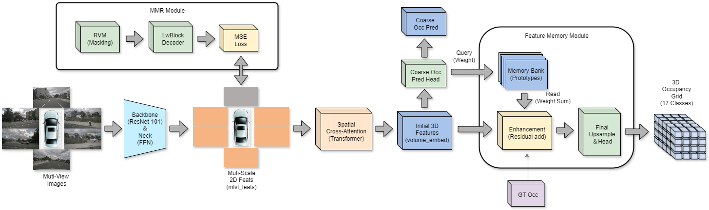

# M²-Occ: Resilient 3D Semantic Occupancy Prediction for Autonomous Driving with Incomplete Camera Inputs
This repository contains the official implementation of M²-Occ, a robust framework for 3D semantic occupancy prediction that maintains perceptual integrity under missing camera views. Our method addresses the critical real-world challenge of sensor failures (occlusion, hardware malfunction, communication loss) in autonomous driving systems.
## Method 

Method Pipeline:

